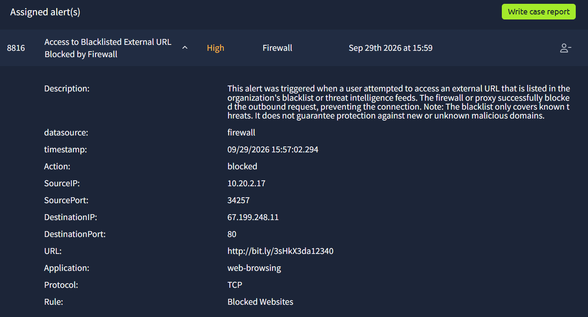
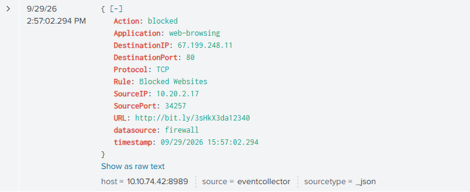
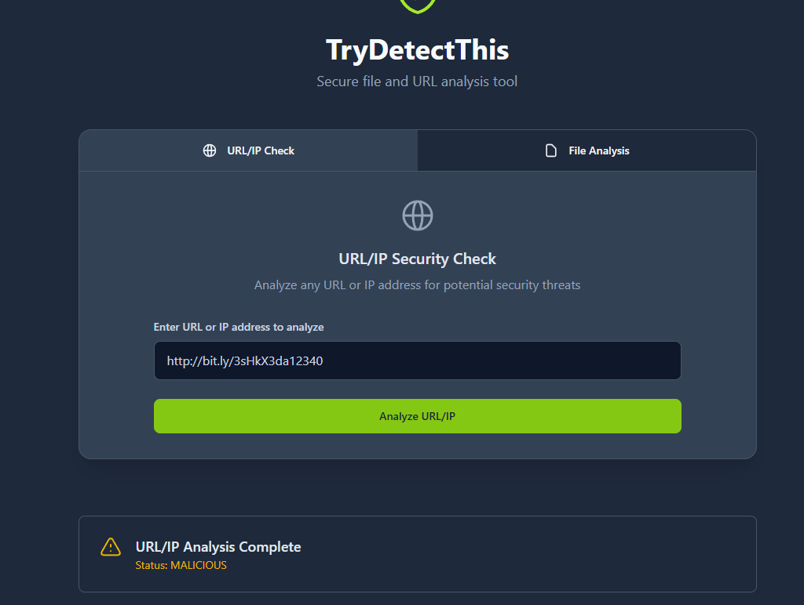
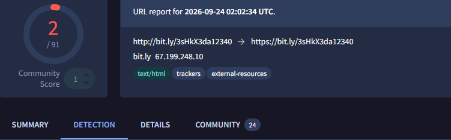

# SOC Investigation: Phishing Alert

## Scenario

An alert was triggered by an inbound email containing an external link.

## Objective

Determine whether the alert represents malicious activity or a false positive.

## Tools Used

- SIEM
- Splunk
- Firewall logs
- Proxy logs
- Wireshark

## Investigation

### 1. Review the Alert

I reviewed the initial alert and identified the relevant indicators.

--> Alert ID — 8816.

--> Alert name — Access to Blacklisted External URL Blocked by Firewall.

--> Severity and risk score — High.

### 2. SIEM Investigation

I searched the SIEM for related activity using the available indicators.

--> URL: hxxps[://]bit[.]ly/3sHkX3da12340
--> DestinationIP: 67.199.248.11
--> Rule: Blocked Websites
--> timestamp: 09/29/2026 15:57:02.294

### 3. URL Investigation

I use TrydetectThis and VirusTotal on the URl.
--> It will redirect user to 67.199.248.1
--> The available results flagged the URL and related infrastructure as malicious, including indicators associated with phishing and command-and-control activity.

### 4. Classification

Classification: True Positive

Reason:
The activity is under True Positive as it blocked the outbound request from host 10.20.2.17 sending to 67.199.248.11 under Destination Port  80. It is used to access a website 
URL: http://bit.ly/3sHkX3da12340. It is blocked by the Firewall as it is listed a blacklist sites.

The URL will redirect user to 67.199.248.1. Using VirusTotal, TrydetectThis, they state it is malicious and flag as phishing and C2 infrastructure (data Exfiltration) .

Time of the incident is 09/29/2026 15:57:02.294. The source IP clicked on the URL on internal network . This may cause the attacker to be able to bypass network or lead to data exfiltration.

The immediate action was taken which is blocking the URL(prevent successful connection) 
No need for escalation as the firewall is able to prevent it 

### Lesson learnt

--> I learned how to investigate a security alert using SIEM logs.
--> I learned how to correlate IP addresses, usernames and timestamps across different logs.
--> I learned that an alert needs to be investigated using supporting evidence before deciding whether it is a true or false positive.
--> I improved my understanding of how SOC analysts perform alert triage and document their findings.
--> I learn to more detail when answering the question

