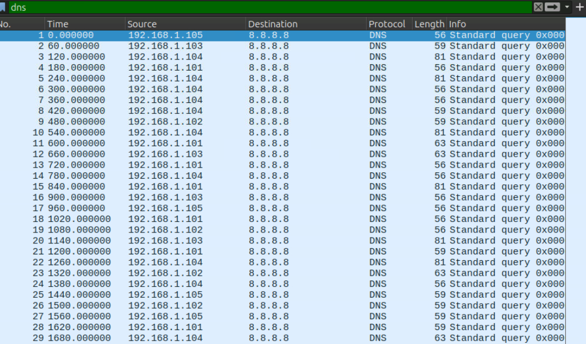
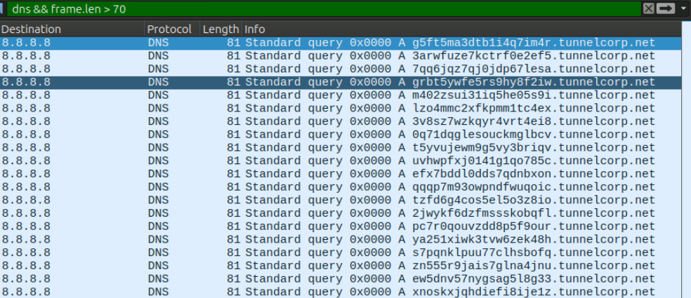
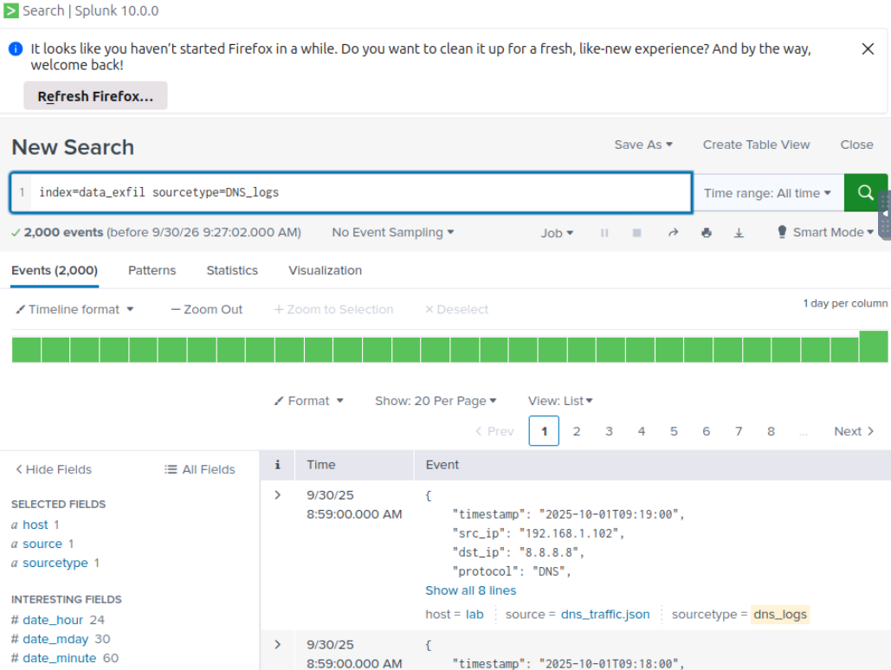
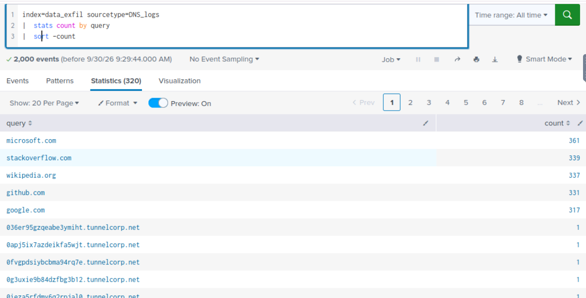
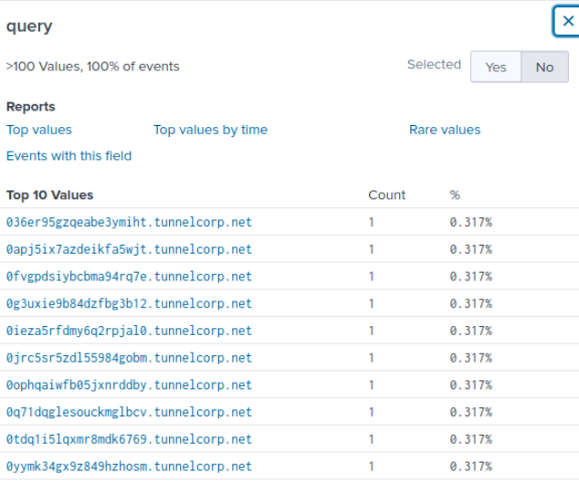

# SOC Investigation: DNS Exfiltration Detection

## Room

TryHackMe: Data Exfiltration Detection

## Objective

Identify possible DNS tunneling and determine which internal hosts and external domains are involved in the suspicious DNS activity.

## Tools Used

* Wireshark
* Splunk
* DNS logs
* `dns_exfil.pcap`

## Investigation

### 1. DNS Traffic Analysis

I started by filtering the packet capture for DNS traffic using:

```text
dns
```

I then filtered for DNS queries without responses:

```text
dns.flags.response == 0
```

This helped narrow the investigation to outbound DNS queries.



### 2. Identify Long DNS Queries

I searched for unusually large DNS packets using:

```text
dns && frame.len > 70
```

The results showed DNS requests with unusually large lengths. Long and unusual DNS queries are worth investigating because DNS tunneling can encode data inside query names.


### 3. Identify the Suspicious Domain

I filtered the traffic based on the suspicious domain identified during the investigation.

```text
dns && dns.qry.name contains <suspicious-domain>
```

The traffic showed repeated DNS requests being sent to the same external domain.



### 4. Splunk Investigation

I then correlated the packet-capture findings with DNS logs in Splunk.

Initial search:

```text
index=data_exfil sourcetype=DNS_logs
```

This allowed me to review the DNS events available in the dataset.



### 5. DNS Query Count by Source IP

I used the following query to identify which internal hosts generated the most DNS requests:

```text
index="data_exfil" sourcetype="DNS_logs" | stats count by src_ip
```



I compared the request counts to identify the internal IP generating the highest amount of suspicious DNS traffic.

### 6. Identify Long DNS Queries in Splunk

I searched for unusually long DNS queries using:

```text
index="data_exfil" sourcetype="DNS_logs" | where len(query) > 30
```

The results showed unusually long DNS query names, which provided another indicator of possible DNS tunneling.



## Indicators of Suspicious Activity

The investigation identified several indicators associated with possible DNS tunneling:

* High volume of DNS queries
* Repeated requests to a single external domain
* Unusually long DNS query names
* DNS queries without responses
* Internal hosts generating unusually high DNS request counts

## Findings

The network traffic showed characteristics consistent with DNS tunneling. Multiple internal hosts generated repeated DNS queries to the same external domain, while some queries contained unusually long names.

The Splunk investigation was used to correlate the network traffic with DNS logs and identify the internal source generating the highest number of suspicious requests.

## Investigation Results

Suspicious domain:

`tunnelcorp.net`

Number of suspicious DNS tunneling events:

`315`

Local IP with the highest number of suspicious requests:

`192.168.1.103`

## Lessons Learned

* I learned how DNS traffic can be analysed for indicators of possible data exfiltration.
* I learned how unusually long DNS queries and high query volumes can help identify suspicious activity.
* I learned how to use Wireshark filters to narrow down network traffic during an investigation.
* I learned how to use Splunk to correlate DNS logs with source IP addresses and query counts.
* I improved my understanding of how SOC analysts combine network traffic analysis with SIEM data during an investigation.

