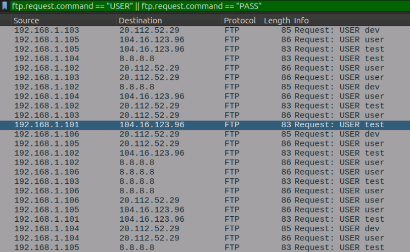
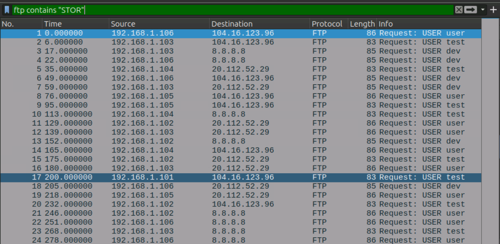
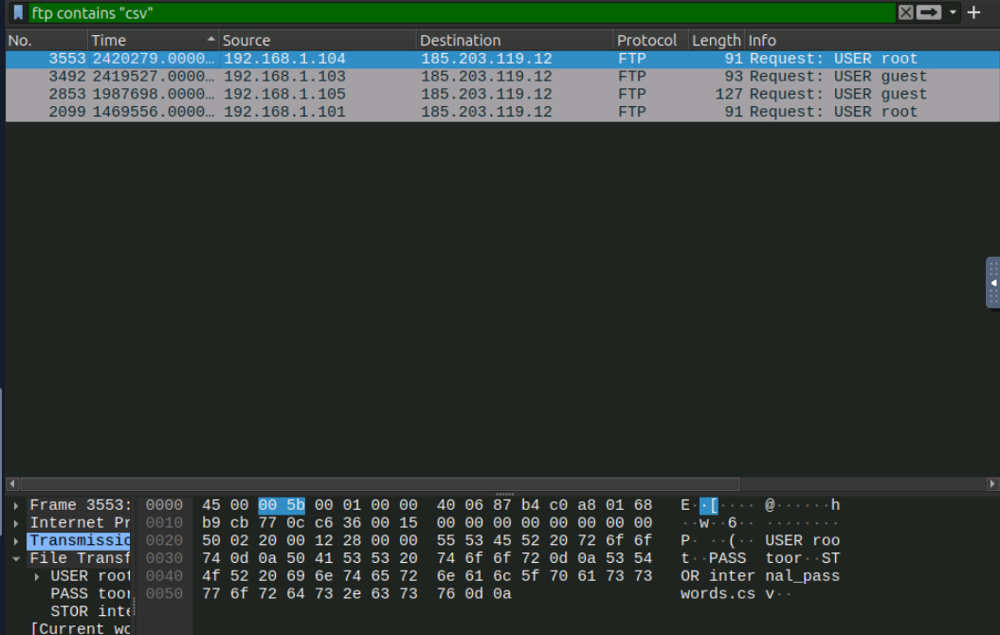
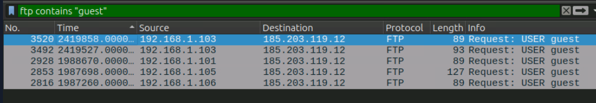
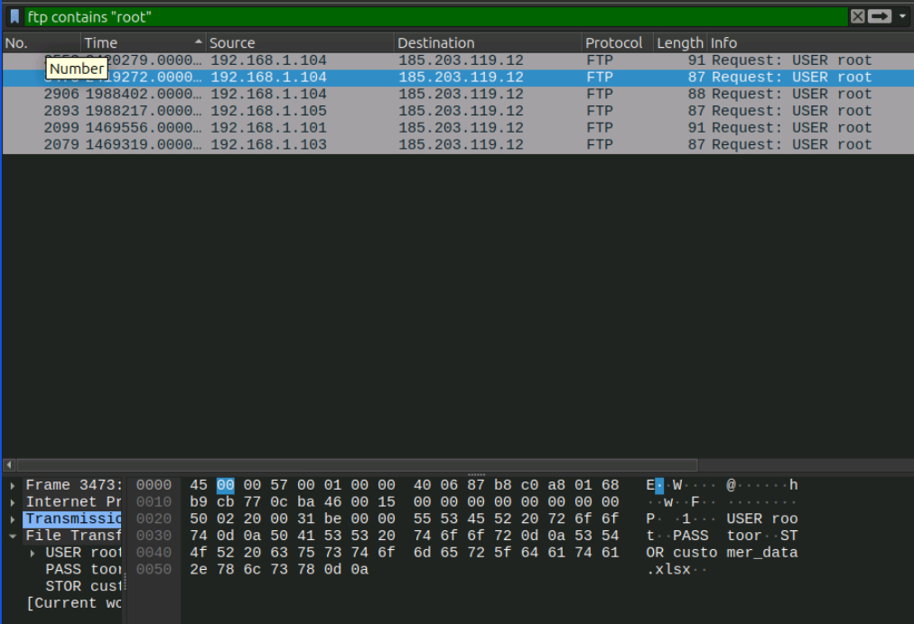
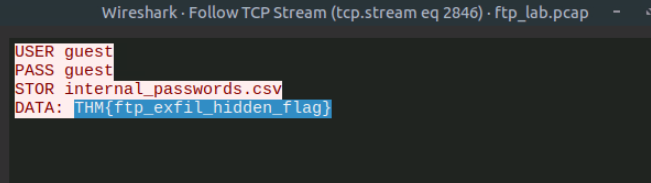

# SOC Investigation: FTP Exfiltration

## Room

TryHackMe: Data Exfiltration Detection

## Objective

Identify suspicious FTP activity and determine whether files were being transferred from an internal network to an external destination.

## Tools Used

* Wireshark
* FTP packet capture
* TCP Stream analysis
* Network traffic analysis

## Investigation

### 1. Identify FTP Traffic

I started by filtering the packet capture for FTP control and data traffic.

```text
ftp || ftp-data
```

This allowed me to isolate the FTP-related communication.


### 2. Investigate FTP Credentials

I searched for FTP login activity using:

```text
ftp.request.command == "USER" || ftp.request.command == "PASS"
```

This allowed me to identify usernames and authentication activity within the FTP traffic.



### 3. Identify File Uploads

I searched for FTP `STOR` commands:

```text
ftp contains "STOR"
```

The `STOR` command is associated with uploading a file to an FTP server, so I reviewed the related traffic for potentially suspicious file transfers.



### 4. Investigate File Names

I searched for CSV files using:

```text
ftp contains "csv"
```

The investigation identified a CSV file being transferred through an FTP session.




### 5. Investigate Large Payloads

I searched for larger FTP packets using:

```text
ftp && frame.len > 90
```

I reviewed the resulting traffic and followed the relevant TCP streams to identify potentially sensitive files being transferred.


## Indicators of Suspicious Activity

The investigation identified several indicators:

* FTP activity involving a Guest account
* File upload activity using the `STOR` command
* CSV files being transferred
* Communication with an external IP address
* Large FTP payloads
* Sensitive-looking filenames or documents
* Data transfers involving internal hosts

## Investigation Results

Connections observed from the Guest account:



`ftp contains "guest"`
I count the number of packets which have 5 
`5`

Customer-related file exfiltrated from the root account:



`ftp contains "root"`
I look at the payload and found out customer_data.xlsx which is most likely the answer as it is related to customers
`customer_data.xlsx`

Internal IP sending the largest payload:


`ftp && frame.len > 90`
Looking the Length, I found the largest which is 127 and I link it back to the source IP  
`192.168.1.105`

Flag identified in the FTP stream:



I then followed the relevant TCP stream to examine the FTP session and identify additional information about the transfer.
`THM{ftp_exfil_hidden_flag}`

## Findings

The FTP traffic showed activity consistent with possible data exfiltration. An internal host transferred files to an external destination using FTP.

The investigation identified suspicious account activity, file upload commands, CSV files and large payloads. TCP Stream analysis was used to examine the contents and context of the FTP sessions.

## Lessons Learned

* I learned how to identify FTP control and data traffic using Wireshark.
* I learned how `USER`, `PASS` and `STOR` commands can provide useful indicators during an FTP investigation.
* I learned how to follow a TCP stream to investigate the contents of a network session.
* I learned how filenames, destination IPs and payload sizes can help identify suspicious file transfers.
* I improved my understanding of how network packet analysis can be used to investigate possible data exfiltration.

