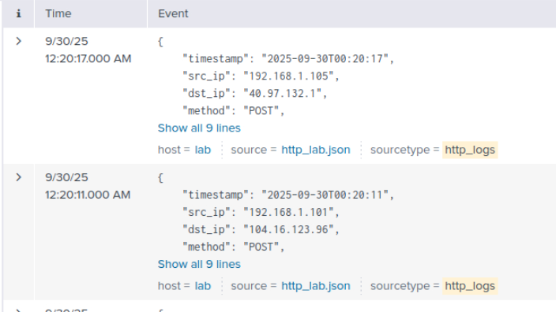
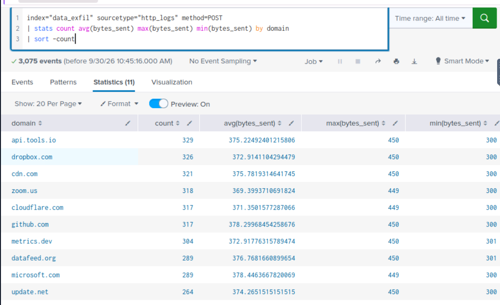
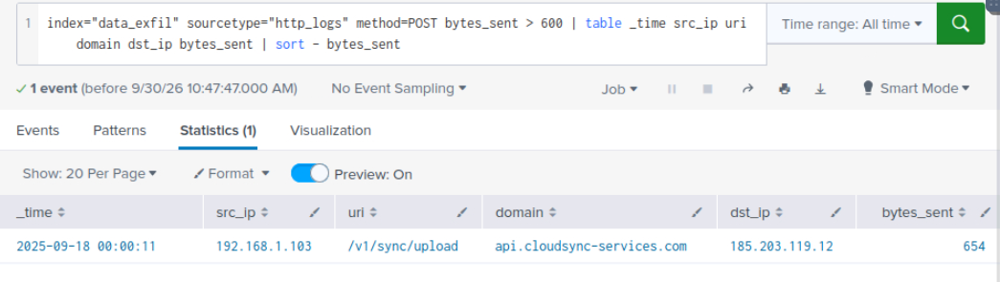

# SOC Investigation: HTTP Exfiltration

## Room

TryHackMe: Data Exfiltration Detection

## Objective

Identify suspicious HTTP activity and determine whether sensitive data was being exfiltrated from an internal host to an external destination.

## Tools Used

* Splunk
* Wireshark
* HTTP packet capture
* HTTP Stream analysis
* Network traffic analysis

## Investigation

### 1. Analyze HTTP Logs in Splunk

I started by searching the HTTP logs in Splunk:


```text
index="data_exfil" sourcetype="http_logs"
```

I set the time range to All Time to review the available HTTP activity.

### 2. Filter HTTP POST Requests

Since HTTP POST requests can be used to upload data to an external server, I filtered for POST requests:



```text
index="data_exfil" sourcetype="http_logs" method=POST
```

This reduced the number of results and allowed me to focus on HTTP upload activity.

### 3. Analyze Bytes Sent

I then compared the amount of data sent to different domains:



```text
index="data_exfil" sourcetype="http_logs" method=POST | stats count avg(bytes_sent) max(bytes_sent) min(bytes_sent) by domain | sort - count
```

This helped identify domains receiving unusually large amounts of data.

### 4. Identify Large POST Requests

I filtered for POST requests sending more than 600 bytes:



```text
index="data_exfil" sourcetype="http_logs" method=POST bytes_sent > 600 | table _time src_ip uri domain dst_ip bytes_sent | sort - bytes_sent
```

The results showed a suspicious HTTP request involving a large amount of data being sent to an external destination.


### 5. Analyze HTTP Traffic in Wireshark

I opened the `http_lab.pcap` file in Wireshark and filtered for HTTP traffic:

```text
http
```

This showed both GET and POST requests within the packet capture.


### 6. Filter HTTP POST Requests

I then filtered for HTTP POST requests:

```text
http.request.method == "POST"
```

This allowed me to focus on requests potentially carrying uploaded data.


### 7. Identify Large HTTP Packets

I first filtered for POST packets larger than 500 bytes:

```text
http.request.method == "POST" and frame.len > 500
```

I then increased the threshold to 750 bytes:

```text
http.request.method == "POST" and frame.len > 750
```

This reduced the traffic to a suspicious POST request that matched the activity identified in Splunk.


### 8. Follow the HTTP Stream

I followed the HTTP stream for the suspicious POST request to examine the transferred data.


The HTTP stream contained the sensitive data being transferred to the external destination.

## Indicators of Suspicious Activity

The investigation identified several indicators:

* Large HTTP POST request
* Large amount of data sent to an external destination
* Suspicious external destination
* HTTP traffic containing sensitive data
* Internal host communicating with an external IP
* Data transfer identified through HTTP Stream analysis

## Investigation Results

### Internal Compromised Host


I identified the internal source IP from the suspicious large POST request in Splunk and confirmed it against the corresponding Wireshark traffic.

`[Insert internal IP from your lab]`

### Flag Identified in the Exfiltrated Data


I followed the HTTP stream and examined the transferred data. The hidden TryHackMe flag was identified inside the exfiltrated data.

`[Insert flag from your lab]`

## Findings

The investigation identified HTTP activity consistent with possible data exfiltration. A large POST request was sent from an internal host to an external destination.

Splunk was used to identify the suspicious HTTP request, while Wireshark was used to correlate the network traffic and examine the HTTP stream.

The investigation confirmed that sensitive data was present within the transferred HTTP traffic.

## Lessons Learned

* I learned how to identify suspicious HTTP POST requests using Splunk.
* I learned how `bytes_sent` can help identify unusually large data transfers.
* I learned how to use Wireshark filters to isolate suspicious HTTP traffic.
* I learned how to correlate SIEM logs with packet capture data.
* I learned how to follow an HTTP stream to examine transferred data.
* I improved my understanding of how HTTP can be abused for data exfiltration.

