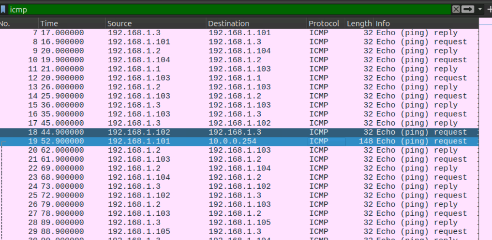
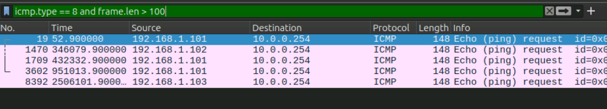
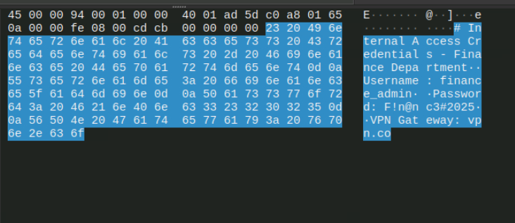
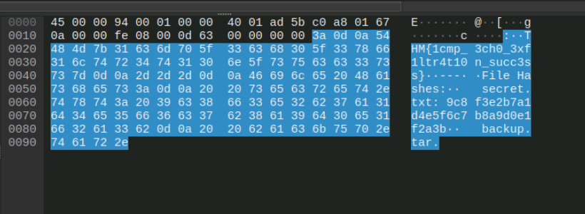

# SOC Investigation: ICMP Exfiltration

## Room

TryHackMe: Data Exfiltration Detection

## Objective

Identify suspicious ICMP traffic and determine whether data was being exfiltrated through ICMP packets.

## Tools Used

* Wireshark
* ICMP packet capture
* Network traffic analysis
* ICMP payload analysis

## Investigation

### 1. Identify ICMP Traffic

I started by filtering the packet capture for ICMP traffic:



```text
icmp
```

This allowed me to isolate ICMP packets and review the communication between internal and external hosts.

### 2. Identify Echo Requests

I filtered for ICMP Echo Request packets:


```text
icmp.type == 8
```

Echo Requests are commonly used for ping operations, so I reviewed the traffic for unusual activity.

### 3. Identify Large ICMP Packets

I then filtered for Echo Requests with a frame length greater than 100 bytes:



```text
icmp.type == 8 and frame.len > 100
```

Normal ping traffic is usually much smaller. The larger packets were therefore investigated further for possible data hidden inside the ICMP payload.

### 4. Analyze the ICMP Payload

I selected the suspicious ICMP packet and examined the ICMP payload for hidden information.



The payload contained the hidden TryHackMe flag.

## Indicators of Suspicious Activity

The investigation identified several indicators:

* Frequent ICMP Echo Requests
* ICMP packets larger than normal ping traffic
* Unusual ICMP payload contents
* Repeated communication with an external host
* Data contained within ICMP packet payloads

## Investigation Results

### Flag Found in the ICMP Exfiltration

)

The hidden flag was identified by examining the payload of the suspicious ICMP Echo Request.

`THM{1cmp_3ch0_3xf1ltr4t10n_succ3ss}`

## Findings

The investigation identified ICMP traffic with unusually large Echo Request packets. Examination of the ICMP payload revealed data being transferred through the packets.

The traffic showed characteristics consistent with ICMP-based data exfiltration.

## Lessons Learned

* I learned how to identify ICMP traffic using Wireshark.
* I learned how ICMP Echo Requests can be investigated for suspicious activity.
* I learned how packet size can help identify abnormal ICMP traffic.
* I learned how to inspect ICMP payloads for hidden data.
* I improved my understanding of how ICMP can be abused for data exfiltration.
